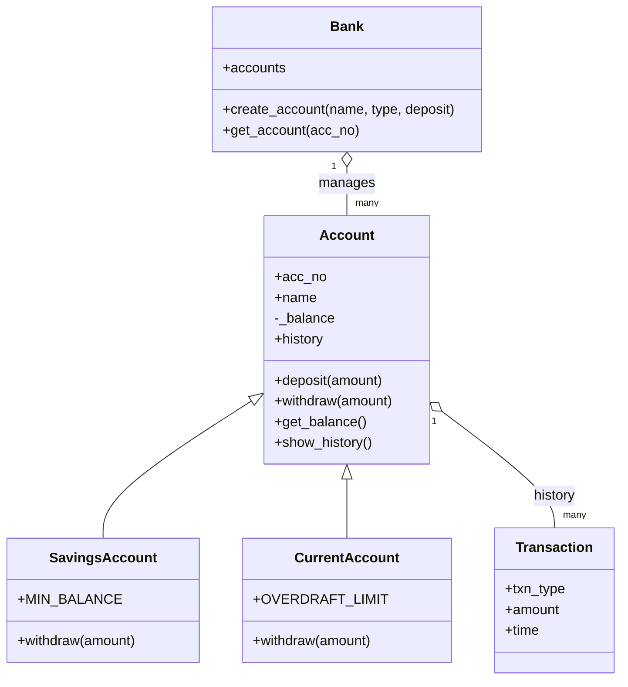

# Simple Python Banking System (OOP)

A beginner-to-intermediate OOP project for **Module 3: Object-Oriented Programming**.

Built to be simple and readable — each OOP concept maps to one clear piece of code,
so it's easy to explain in an interview or a viva.

## OOP Concepts Used

| Concept | Where it appears |
|---|---|
| **Class & Object** | `Account`, `Transaction`, `Bank` classes; each account is an object |
| **Constructor** | `__init__` in every class initializes attributes |
| **Encapsulation** | `_balance` is protected — only changed through `deposit()` / `withdraw()`, never directly |
| **Inheritance** | `SavingsAccount` and `CurrentAccount` both inherit from `Account` |
| **Polymorphism** | Each subclass has its own `withdraw()` — same method name, different behavior |
| **Clean code** | One responsibility per class: `Transaction` only logs, `Bank` only manages accounts, `Account` only manages money |

## Class Diagram



## Design Decisions

- **Inheritance over duplication**: `SavingsAccount` and `CurrentAccount` share all common logic
  (deposit, balance check, history) from `Account`, and only override `withdraw()` where
  the rules genuinely differ (minimum balance vs. overdraft limit).
- **Encapsulation**: `_balance` is never edited directly from outside the class — always through
  `deposit()`/`withdraw()`, which validate the amount first. This prevents invalid states like a
  negative balance from bad input.
- **Bank as a manager class**: keeps account creation/lookup separate from account logic itself,
  following the single-responsibility principle.

## How to Run
```bash
python banking_system.py
```

## Menu Options
1. Create Account (choose Savings or Current)
2. Deposit
3. Withdraw
4. Check Balance
5. Transaction History
6. Exit

## Author
Ajit — B.Tech AI/ML, HMRITM
